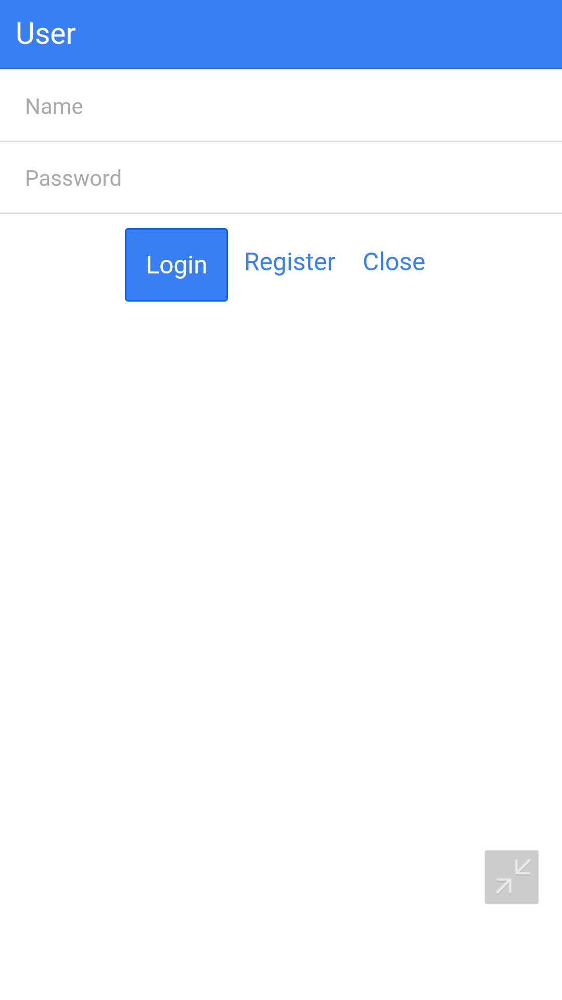
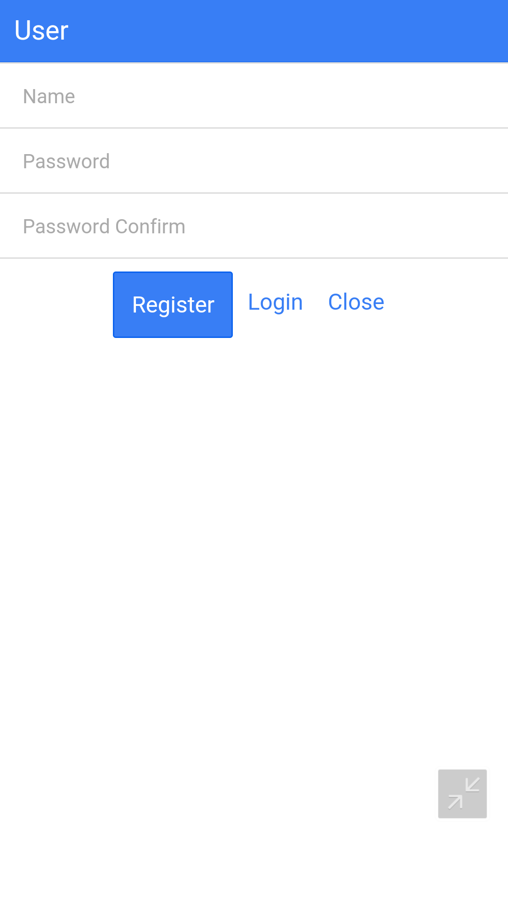
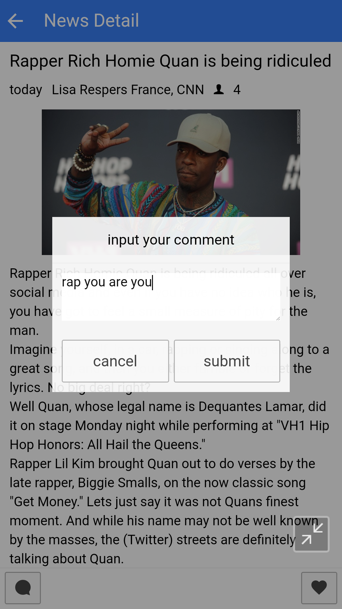
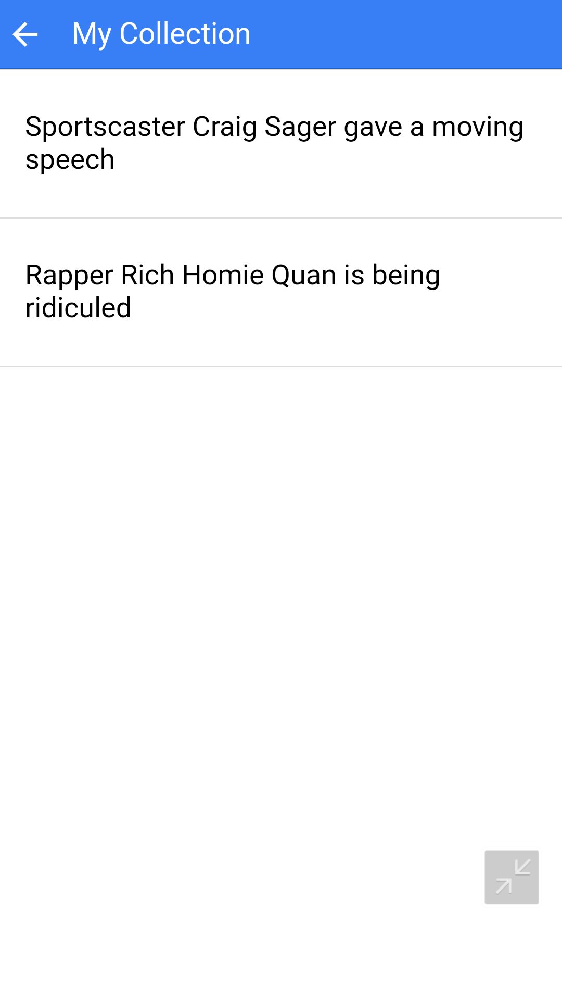

# description  
a news mobile app called nut news    
support android and ios  

# technology
## client
phonegap 2.0   
ionic 1.0.1  
angular 1.0  
## server
ruby 1.8.7  
sinatra 1.4.7   
sqlite3  
json 1.0.0   
git source control  

# functions
news list  
get more news while reach bottom  
news detail  
user login  
user register  
collect news  
post a comment  

# snapshot
  
  
   
  
   
  
   
  
   
  
   
  
         
